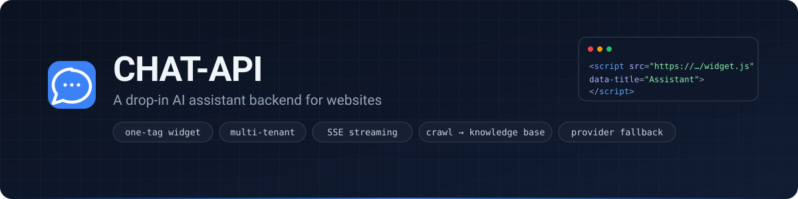
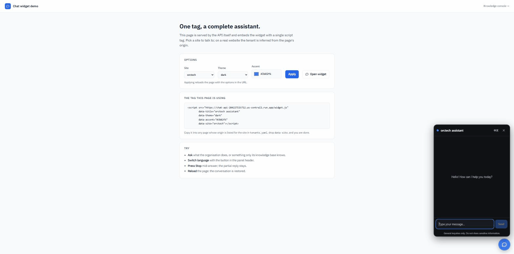
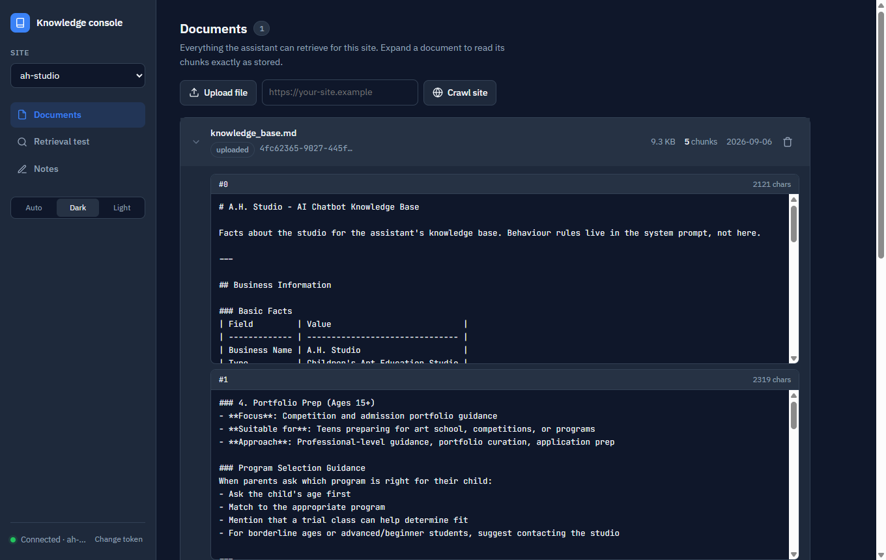
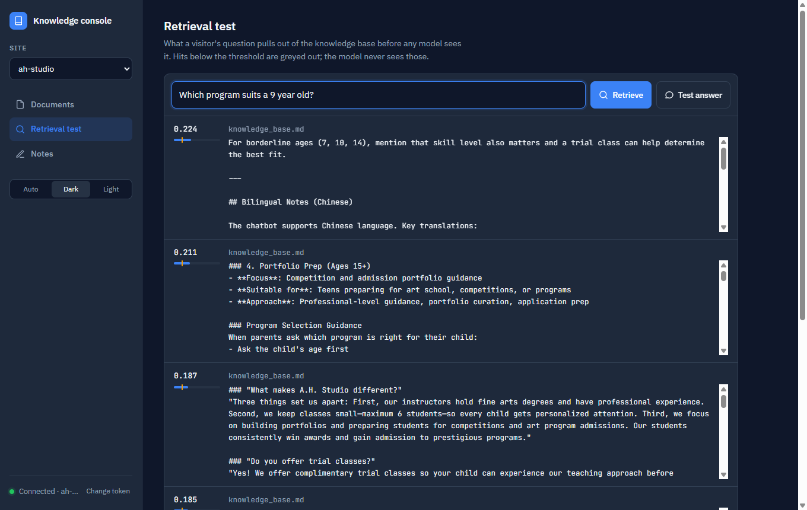
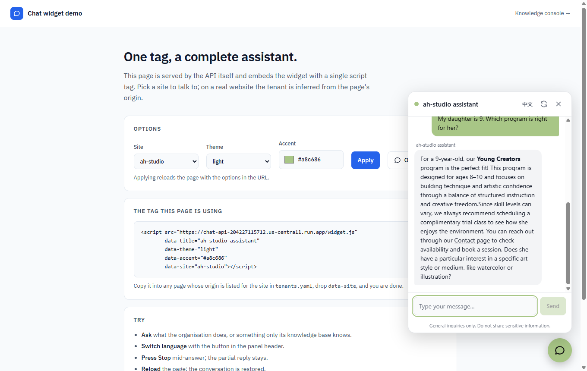
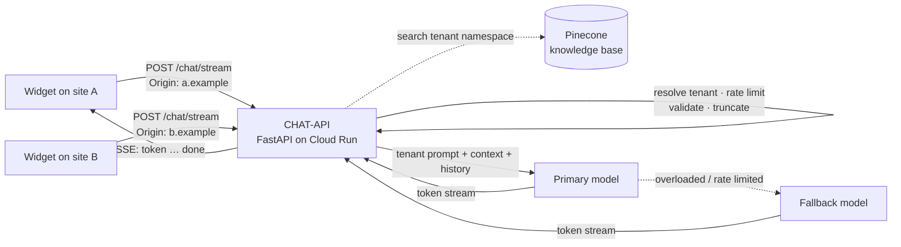
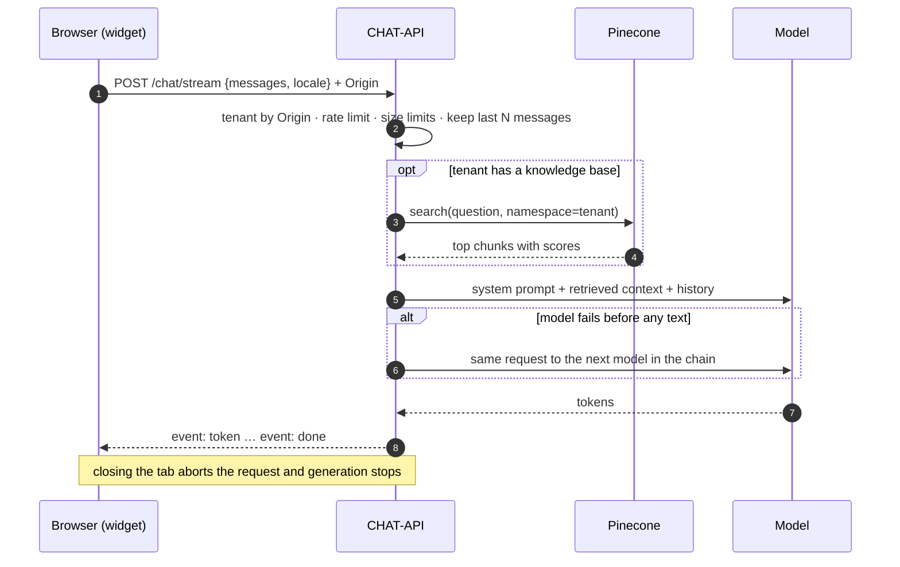

<p align="center">
  
</p>

<p align="center">
  <a href="https://github.com/UAACC/CHAT-API/actions/workflows/ci.yml"></a>
  
  
  
  <a href="LICENSE"></a>
  <a href="https://chat-api-204227115712.us-central1.run.app/widget/demo"></a>
</p>

<p align="center">
  <a href="https://chat-api-204227115712.us-central1.run.app/widget/demo"><b>Live demo</b></a> ·
  <a href="https://chat-api-204227115712.us-central1.run.app/admin"><b>Knowledge console</b></a> ·
  <a href="docs/guide.md"><b>Operator's guide</b></a> ·
  <a href="deployments/README.md"><b>Deploy</b></a> ·
  <a href="CHANGELOG.md"><b>Changelog</b></a>
</p>

Give it a system prompt that describes your organisation, add one script tag
to your site, and visitors get streamed, bilingual answers with guard-rails
against made-up prices and runaway costs. One deployment serves many sites.

It runs the assistants on [allisonhe.ca](https://allisonhe.ca) (a children's
art studio) and [orctech.ca](https://orctech.ca) (a technology consultancy)
from a single Cloud Run service.

<p align="center">
  
</p>

## Features

| | |
|---|---|
| **One-tag widget** | `<script src="https://<service>/widget.js">` adds a complete chat panel: streaming, stop, retry, EN/中文 toggle, persistence, dark/light themes. No build step, styles isolated in a Shadow DOM, 6.5 KB gzipped. |
| **Multi-tenant** | Each site is a tenant with its own prompts, model, limits and knowledge-base namespace, matched by the request's `Origin`. Add a site by adding a YAML block. |
| **Streaming with cost guards** | Server-Sent Events token by token; generation stops when the tab closes. Per-tenant, per-IP rate limiting, input and history limits, context truncation. |
| **Providers with fallback** | Google Gemini, OpenAI and Anthropic through LangChain. A site lists backup models that take over when the primary is overloaded, rate limited or out of credit. |
| **Knowledge base from the website** | `POST /rag/crawl` fetches the site, extracts readable text and indexes one document per page. Upload PDFs and Markdown too. Retrieval degrades gracefully when absent. |
| **Knowledge console** | Read every stored chunk, see what a question retrieves with scores against the threshold, check the answer with its context, and add facts as notes that are live within seconds. |
| **Small and tested** | FastAPI, ~2.3k lines, 137 tests that run offline in two seconds, one Dockerfile, CI with a container smoke test. |

## Screenshots

<table>
  <tr>
    <td width="50%"><br><sub><b>Console · Documents</b>: every chunk exactly as stored, with source and size.</sub></td>
    <td width="50%"><br><sub><b>Console · Retrieval test</b>: what a question pulls in, scored against the threshold.</sub></td>
  </tr>
  <tr>
    <td colspan="2"><br><sub><b>Widget</b> on the demo page, light theme with the site's accent colour; the answer cites the knowledge base.</sub></td>
  </tr>
</table>

## By the numbers

| Metric | Value | How measured |
|--------|-------|--------------|
| Time to first token | **0.97 s** median (warm) | 5 streamed requests against production, Gemini Flash-Lite |
| Widget payload | **6.5 KB** gzipped, 19 KB raw | `curl -H 'Accept-Encoding: gzip' /widget.js` |
| Test suite | **137** cases, **~2 s**, no network | `pytest -q` |
| Application code | **2,273** lines of Python | non-blank lines under `app/` |
| Endpoints | **14** | `/openapi.json` |
| Sites in production | **2** on one service | `GET /health` |

Cold starts on a scaled-to-zero Cloud Run instance add several seconds to the
first request; `--min-instances 1` removes them.

## How it works



One request, end to end:



## Quick start

```bash
git clone https://github.com/UAACC/CHAT-API.git && cd CHAT-API
python -m venv venv && source venv/bin/activate      # Windows: venv\Scripts\activate
pip install -r requirements-dev.txt
cp .env.example .env                                   # set LLM_PROVIDER and one API key
uvicorn app.main:app --reload --port 8080
```

Then talk to it:

```bash
curl -N -X POST http://localhost:8080/chat/stream \
  -H "Content-Type: application/json" \
  -d '{"session_id":"demo","messages":[{"role":"user","content":"What can you help with?"}],"locale":"en"}'
```

Or skip Python entirely:

```bash
docker build -t chat-api .
docker run --rm -p 8080:8080 -e LLM_PROVIDER=gemini -e GEMINI_API_KEY=your-key chat-api
```

Open `http://localhost:8080/widget/demo` to chat, and `/admin` for the
console. Gemini's free tier is enough for a small site; see the
[operator's guide](docs/guide.md#llm-providers) for model notes.

## Embedding the widget

```html
<script src="https://chat-api-204227115712.us-central1.run.app/widget.js"
        data-title="Studio Assistant"
        data-accent="#a8c686"
        data-theme="dark"></script>
```

That is the whole integration. `data-*` attributes set the title, greeting,
accent colour, theme (`dark` / `light` / `auto`), corner and initial
language; `window.ChatWidget` exposes `open()`, `close()` and `send(text)`
for your own buttons. Sites with their own design can talk to the API
directly; see [Frontend integration](docs/guide.md#frontend-integration).

## Adding a site

Add a tenant to `deployments/tenants.yaml`:

```yaml
tenants:
  my-site:
    name: My Site
    origins: [https://my-site.example, https://www.my-site.example]
    llm: { provider: gemini, model: gemini-3.1-flash-lite, api_key_env: MY_SITE_GEMINI_API_KEY }
    fallbacks:
      - { provider: gemini, model: gemini-3.5-flash-lite, api_key_env: MY_SITE_GEMINI_API_KEY }
    prompts:
      en: |
        You are the assistant for My Site. ...
    knowledge_base: { namespace: my-site }   # optional
```

Put the key in Secret Manager, mount it as `MY_SITE_GEMINI_API_KEY`, redeploy,
and point the site's widget at the service URL. Requests are routed by
`Origin`; a single-site deployment can skip the file entirely and configure
everything with environment variables. Details in
[deployments/README.md](deployments/README.md).

## API

| Endpoint | Description |
|----------|-------------|
| `POST /chat/stream` | Streaming chat (SSE events `token`, `done`, `error`) |
| `POST /chat` | Same request, single JSON reply |
| `GET /widget.js`, `GET /widget/demo` | Embeddable widget and a demo page |
| `GET /admin` | Knowledge console (needs `ADMIN_TOKEN`) |
| `POST /rag/crawl` | Build the knowledge base from a website |
| `POST /rag/documents/upload`, `GET /rag/documents`, `GET /rag/documents/{id}/chunks`, `DELETE /rag/documents/{id}` | Knowledge base management |
| `GET /rag/search?q=`, `GET`/`PUT /rag/notes` | Retrieval test and curated notes |
| `GET /health`, `GET /rag/status` | Liveness, tenants, storage and vector-store connectivity |
| `GET /docs` | Interactive OpenAPI docs |

Request body:

```json
{
  "session_id": "1736789012345-a8b3c9d",
  "messages": [{ "role": "user", "content": "Do you offer trial classes?" }],
  "locale": "en",
  "page_url": "https://example.com/programs"
}
```

## Configuration

| Variable | Default | Purpose |
|----------|---------|---------|
| `TENANTS_FILE` | – | Multi-site mode: path to a tenants YAML file; the variables below then only supply shared settings |
| `LLM_PROVIDER` | `openai` | `openai`, `anthropic` or `gemini` |
| `GEMINI_API_KEY` / `OPENAI_API_KEY` / `ANTHROPIC_API_KEY` | – | Key for the chosen provider |
| `GEMINI_MODEL` / `OPENAI_MODEL` / `ANTHROPIC_MODEL` | `gemini-3.1-flash-lite` / `gpt-4o-mini` / `claude-3-haiku-20240307` | Model per provider |
| `SYSTEM_PROMPT_EN`, `SYSTEM_PROMPT_ZH` | generic | Site prompts |
| `CORS_ORIGINS` | localhost | Allowed origins, comma separated |
| `RATE_LIMIT_REQUESTS` / `RATE_LIMIT_WINDOW` | `20` / `60` | Per-IP limit per window (s) |
| `MAX_INPUT_LENGTH`, `MAX_MESSAGES_PER_SESSION`, `MAX_CONTEXT_MESSAGES` | `500`, `20`, `10` | Size limits |
| `PINECONE_API_KEY`, `PINECONE_INDEX` | – | Turns on the knowledge base |
| `ADMIN_TOKEN` | – | Bearer token required by the knowledge-base endpoints and console; open (with a warning) when unset |

Full reference: [docs/guide.md](docs/guide.md#configuration).

## How it compares

| | Hand-rolled `fetch` to a model | Hosted chatbot SaaS | CHAT-API |
|---|:---:|:---:|:---:|
| Runs on your infrastructure, your keys | ✓ | – | ✓ |
| Streaming with stop-on-disconnect | build it | ✓ | ✓ |
| Rate limits and size limits | build it | ✓ | ✓ |
| Many sites from one deployment | build it | per-seat pricing | ✓ |
| Knowledge base from the site itself | build it | ✓ | ✓ |
| See what the bot knows and test retrieval | – | sometimes | ✓ |
| Model fallback across providers | build it | – | ✓ |
| Widget you can restyle or replace | – | limited | ✓ |
| Cost for a small site | model usage | subscription | model usage (free tier works) |

## Development

```bash
pytest -q                   # 137 tests, no network, ~2 s
docker build -t chat-api .  # what CI and Cloud Run build
```

```
app/
  main.py              app factory, CORS, lifespan
  config.py            shared settings (pydantic-settings)
  tenants.py           tenant model, YAML loader, per-request resolution
  routes/              chat, health, rag, widget endpoints
  services/            llm_service (providers, streaming, fallback), crawler, vector store, documents, storage
  middleware/          in-memory rate limiter (per tenant and IP)
  prompts/             generic default prompts
  widget/              embeddable widget (widget.js), demo page, knowledge console
deployments/           tenants.yaml, shared env.yaml, knowledge base sources
tests/                 pytest suite with a canned LLM
docs/                  operator's guide, design specs, assets
```

Design notes for each subsystem are in [docs/specs](docs/specs). See
[CONTRIBUTING.md](CONTRIBUTING.md) to get involved and
[SECURITY.md](SECURITY.md) for the threat model.

## Roadmap

- Conversation log with per-site analytics
- Pluggable knowledge sources (Google Docs, Notion, scheduled re-crawls)

## License

[MIT](LICENSE)
