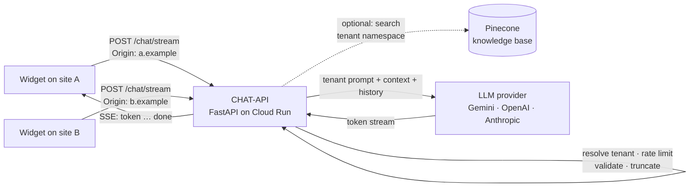

# CHAT-API

[](https://github.com/UAACC/CHAT-API/actions/workflows/ci.yml)
[](LICENSE)


A drop-in AI assistant backend for websites. Point a chat widget at it, give it
a system prompt that describes your organisation, and visitors get streamed,
bilingual answers with guard-rails against made-up prices and runaway costs.

It runs the assistants on [allisonhe.ca](https://allisonhe.ca) (a children's
art studio) and [orctech.ca](https://orctech.ca) (a technology consultancy)
from one Cloud Run service: each site is a tenant with its own prompts, model
and knowledge base, matched by the request's `Origin`.

## Features

- **One-tag widget**: `<script src="https://<service>/widget.js">` adds a
  complete chat panel to any page; no build step, styles isolated in a
  Shadow DOM, under 10 KB gzipped
- **Streaming replies** over Server-Sent Events, with stop-on-disconnect so an
  abandoned tab does not keep burning tokens
- **Multi-tenant**: one deployment serves many websites; a request is routed
  to its site by `Origin`, each site with its own prompts, model, limits and
  knowledge-base namespace
- **Pluggable providers with fallback**: Google Gemini, OpenAI and Anthropic
  through LangChain; each site lists a primary model and backups that take
  over when the primary is overloaded, rate limited or out of credit
- **Prompt-first configuration**: site knowledge lives in a YAML file,
  never in code; English and Chinese prompts selected per request
- **Optional knowledge base**: crawl the site itself or upload PDFs and
  Markdown, get retrieval-augmented answers via Pinecone's integrated
  embeddings; degrades gracefully when absent
- **Knowledge console**: a page at `/admin` to read every stored chunk, test
  what a question retrieves, check the answer, and add or correct facts as
  notes that are live within seconds
- **Cost protection out of the box**: per-IP rate limiting, input and
  conversation length limits, context truncation
- **Small and testable**: FastAPI, ~2k lines, a test suite that runs offline
  in two seconds, one Dockerfile

## How it works



Every request is matched to its site, checked against that site's rate limit
and size limits, trimmed to the last N messages, optionally enriched with
context from the site's knowledge base, and sent to the site's model. Tokens
are relayed to the browser as they arrive.

## Quick start

```bash
git clone https://github.com/UAACC/CHAT-API.git && cd CHAT-API
python -m venv venv && source venv/bin/activate      # Windows: venv\Scripts\activate
pip install -r requirements-dev.txt
cp .env.example .env                                   # set LLM_PROVIDER and one API key
uvicorn app.main:app --reload --port 8080
```

Then talk to it:

```bash
curl -N -X POST http://localhost:8080/chat/stream \
  -H "Content-Type: application/json" \
  -d '{"session_id":"demo","messages":[{"role":"user","content":"What can you help with?"}],"locale":"en"}'
```

Or skip Python entirely:

```bash
docker build -t chat-api .
docker run --rm -p 8080:8080 -e LLM_PROVIDER=gemini -e GEMINI_API_KEY=your-key chat-api
```

Gemini's free tier is enough for a small site; see the
[operator's guide](docs/guide.md#llm-providers) for model notes.

## Embedding the widget

```html
<script src="https://chat-api-204227115712.us-central1.run.app/widget.js"
        data-title="Studio Assistant"
        data-accent="#a8c686"
        data-theme="dark"></script>
```

That is the whole integration. The widget streams replies, remembers the
conversation, switches between English and Chinese, and adapts to phones.
`data-*` attributes set the title, greeting, accent colour, theme
(`dark` / `light` / `auto`), corner and initial language; `window.ChatWidget`
exposes `open()`, `close()` and `send(text)` for your own buttons.

Try it on the live demo:
[chat-api-204227115712.us-central1.run.app/widget/demo](https://chat-api-204227115712.us-central1.run.app/widget/demo).
Sites with their own design can instead talk to the API directly; see
[Frontend integration](docs/guide.md#frontend-integration).

## API

| Endpoint | Description |
|----------|-------------|
| `GET /widget.js`, `GET /widget/demo` | Embeddable widget and a demo page |
| `POST /chat/stream` | Streaming chat (SSE events `token`, `done`, `error`) |
| `POST /chat` | Same request, single JSON reply |
| `GET /health` | Liveness and active provider |
| `GET /admin` | Knowledge console (needs `ADMIN_TOKEN`) |
| `POST /rag/crawl` | Build the knowledge base from a website (`{"url": "https://…"}`) |
| `POST /rag/documents/upload`, `GET /rag/documents`, `GET /rag/documents/{id}/chunks`, `DELETE /rag/documents/{id}` | Knowledge base management |
| `GET /rag/search?q=`, `GET`/`PUT /rag/notes` | Retrieval test and curated notes |
| `GET /docs` | Interactive OpenAPI docs |

Request body:

```json
{
  "session_id": "1736789012345-a8b3c9d",
  "messages": [{ "role": "user", "content": "Do you offer trial classes?" }],
  "locale": "en",
  "page_url": "https://example.com/programs"
}
```

A complete browser client is ~40 lines; see
[Frontend integration](docs/guide.md#frontend-integration).

## Adding a site

Add a tenant to `deployments/tenants.yaml`:

```yaml
tenants:
  my-site:
    name: My Site
    origins: [https://my-site.example, https://www.my-site.example]
    llm: { provider: gemini, model: gemini-3.1-flash-lite, api_key_env: MY_SITE_GEMINI_API_KEY }
    fallbacks:
      - { provider: gemini, model: gemini-3.5-flash-lite, api_key_env: MY_SITE_GEMINI_API_KEY }
    prompts:
      en: |
        You are the assistant for My Site. ...
    knowledge_base: { namespace: my-site }   # optional
```

Put the key in Secret Manager, mount it as `MY_SITE_GEMINI_API_KEY`, redeploy,
and point the site's widget at the service URL. Requests are routed by
`Origin`; a single-site deployment can skip the file entirely and configure
everything with environment variables.

Details: [deployments/README.md](deployments/README.md).

## Configuration

| Variable | Default | Purpose |
|----------|---------|---------|
| `TENANTS_FILE` | – | Multi-site mode: path to a tenants YAML file; the variables below then only supply shared settings |
| `LLM_PROVIDER` | `openai` | `openai`, `anthropic` or `gemini` |
| `GEMINI_API_KEY` / `OPENAI_API_KEY` / `ANTHROPIC_API_KEY` | – | Key for the chosen provider |
| `GEMINI_MODEL` / `OPENAI_MODEL` / `ANTHROPIC_MODEL` | `gemini-3.1-flash-lite` / `gpt-4o-mini` / `claude-3-haiku-20240307` | Model per provider |
| `SYSTEM_PROMPT_EN`, `SYSTEM_PROMPT_ZH` | generic | Site prompts |
| `CORS_ORIGINS` | localhost | Allowed origins, comma separated |
| `RATE_LIMIT_REQUESTS` / `RATE_LIMIT_WINDOW` | `20` / `60` | Per-IP limit per window (s) |
| `MAX_INPUT_LENGTH`, `MAX_MESSAGES_PER_SESSION`, `MAX_CONTEXT_MESSAGES` | `500`, `20`, `10` | Size limits |
| `PINECONE_API_KEY`, `PINECONE_INDEX` | – | Turns on the knowledge base |
| `ADMIN_TOKEN` | – | Bearer token required by the knowledge-base endpoints and console; open (with a warning) when unset |

Full reference: [docs/guide.md](docs/guide.md#configuration).

## Development

```bash
pytest                      # 137 tests, no network, ~2 s
docker build -t chat-api .  # what CI and Cloud Run build
```

Layout:

```
app/
  main.py              app factory, CORS, lifespan
  config.py            shared settings (pydantic-settings)
  tenants.py           tenant model, YAML loader, per-request resolution
  routes/              chat, health, rag endpoints
  services/            llm_service (providers, streaming), crawler, vector store, documents, storage
  middleware/          in-memory rate limiter (per tenant and IP)
  prompts/             generic default prompts
  widget/              embeddable widget (widget.js), demo page, knowledge console
deployments/           tenants.yaml, shared env.yaml, knowledge base sources
tests/                 pytest suite with a canned LLM
docs/                  operator's guide and design specs
```

## Roadmap

- Conversation log with per-site analytics
- Pluggable knowledge sources (Google Docs, Notion, scheduled re-crawls)

## License

[MIT](LICENSE)
