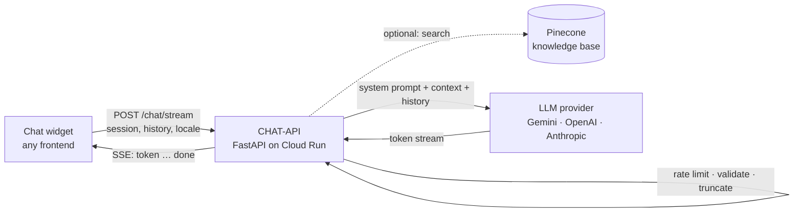

# CHAT-API

[](https://github.com/UAACC/CHAT-API/actions/workflows/ci.yml)
[](LICENSE)


A drop-in AI assistant backend for websites. Point a chat widget at it, give it
a system prompt that describes your organisation, and visitors get streamed,
bilingual answers with guard-rails against made-up prices and runaway costs.

It runs the assistants on [allisonhe.ca](https://allisonhe.ca) (a children's
art studio) and [orctech.ca](https://orctech.ca) (a technology consultancy)
from one codebase: one Cloud Run service per site, configured entirely through
environment variables.

## Features

- **Streaming replies** over Server-Sent Events, with stop-on-disconnect so an
  abandoned tab does not keep burning tokens
- **Pluggable providers**: Google Gemini, OpenAI and Anthropic through
  LangChain; switch with one variable
- **Prompt-first configuration**: site knowledge lives in a deployment file,
  never in code; English and Chinese prompts selected per request
- **Optional knowledge base**: upload PDFs or Markdown, get retrieval-augmented
  answers via Pinecone's integrated embeddings; degrades gracefully when absent
- **Cost protection out of the box**: per-IP rate limiting, input and
  conversation length limits, context truncation
- **Small and testable**: FastAPI, ~2k lines, a test suite that runs offline
  in two seconds, one Dockerfile

## How it works



Every request is checked against the rate limit and size limits, trimmed to
the last N messages, optionally enriched with retrieved context, and sent to
the configured model. Tokens are relayed to the browser as they arrive.

## Quick start

```bash
git clone https://github.com/UAACC/CHAT-API.git && cd CHAT-API
python -m venv venv && source venv/bin/activate      # Windows: venv\Scripts\activate
pip install -r requirements-dev.txt
cp .env.example .env                                   # set LLM_PROVIDER and one API key
uvicorn app.main:app --reload --port 8080
```

Then talk to it:

```bash
curl -N -X POST http://localhost:8080/chat/stream \
  -H "Content-Type: application/json" \
  -d '{"session_id":"demo","messages":[{"role":"user","content":"What can you help with?"}],"locale":"en"}'
```

Or skip Python entirely:

```bash
docker build -t chat-api .
docker run --rm -p 8080:8080 -e LLM_PROVIDER=gemini -e GEMINI_API_KEY=your-key chat-api
```

Gemini's free tier is enough for a small site; see the
[operator's guide](docs/guide.md#llm-providers) for model notes.

## API

| Endpoint | Description |
|----------|-------------|
| `POST /chat/stream` | Streaming chat (SSE events `token`, `done`, `error`) |
| `POST /chat` | Same request, single JSON reply |
| `GET /health` | Liveness and active provider |
| `POST /rag/documents/upload`, `GET /rag/documents`, `DELETE /rag/documents/{id}` | Knowledge base management |
| `GET /docs` | Interactive OpenAPI docs |

Request body:

```json
{
  "session_id": "1736789012345-a8b3c9d",
  "messages": [{ "role": "user", "content": "Do you offer trial classes?" }],
  "locale": "en",
  "page_url": "https://example.com/programs"
}
```

A complete browser client is ~40 lines; see
[Frontend integration](docs/guide.md#frontend-integration).

## Configuring a site

1. Copy `deployments/orctech/env.yaml` to `deployments/<site>/env.yaml`.
2. Write the `SYSTEM_PROMPT_EN` and `SYSTEM_PROMPT_ZH` blocks: who the assistant
   is, verified facts, what it may answer, what it must hand off to a human.
3. Set `CORS_ORIGINS` to the site's origins.
4. Deploy:

```bash
gcloud run deploy <site>-chat-api --region=us-central1 --source=. --allow-unauthenticated \
  --env-vars-file=deployments/<site>/env.yaml \
  --update-secrets="GEMINI_API_KEY=<site>-gemini-api-key:latest"
```

Details, including secrets and the knowledge base, are in
[deployments/README.md](deployments/README.md).

## Configuration

| Variable | Default | Purpose |
|----------|---------|---------|
| `LLM_PROVIDER` | `openai` | `openai`, `anthropic` or `gemini` |
| `GEMINI_API_KEY` / `OPENAI_API_KEY` / `ANTHROPIC_API_KEY` | – | Key for the chosen provider |
| `GEMINI_MODEL` / `OPENAI_MODEL` / `ANTHROPIC_MODEL` | `gemini-3.1-flash-lite` / `gpt-4o-mini` / `claude-3-haiku-20240307` | Model per provider |
| `SYSTEM_PROMPT_EN`, `SYSTEM_PROMPT_ZH` | generic | Site prompts |
| `CORS_ORIGINS` | localhost | Allowed origins, comma separated |
| `RATE_LIMIT_REQUESTS` / `RATE_LIMIT_WINDOW` | `20` / `60` | Per-IP limit per window (s) |
| `MAX_INPUT_LENGTH`, `MAX_MESSAGES_PER_SESSION`, `MAX_CONTEXT_MESSAGES` | `500`, `20`, `10` | Size limits |
| `PINECONE_API_KEY`, `PINECONE_INDEX` | – | Turns on the knowledge base |

Full reference: [docs/guide.md](docs/guide.md#configuration).

## Development

```bash
pytest                      # 44 tests, no network, ~2 s
docker build -t chat-api .  # what CI and Cloud Run build
```

Layout:

```
app/
  main.py              FastAPI app, CORS, lifespan
  config.py            all settings (pydantic-settings)
  routes/              chat, health, rag endpoints
  services/            llm_service (providers, streaming), vector store, documents, storage
  middleware/          in-memory rate limiter
  prompts/             generic default prompts and loader
deployments/           one folder per site: env.yaml (+ knowledge base source)
tests/                 pytest suite with a canned LLM
docs/guide.md          operator's guide
```

## Roadmap

- Embeddable widget served by the API (one `<script>` tag)
- Multi-tenant mode: one service, many sites, keyed by origin
- Website crawler to build the knowledge base from a URL
- Provider fallback when the primary model is overloaded

## License

[MIT](LICENSE)
